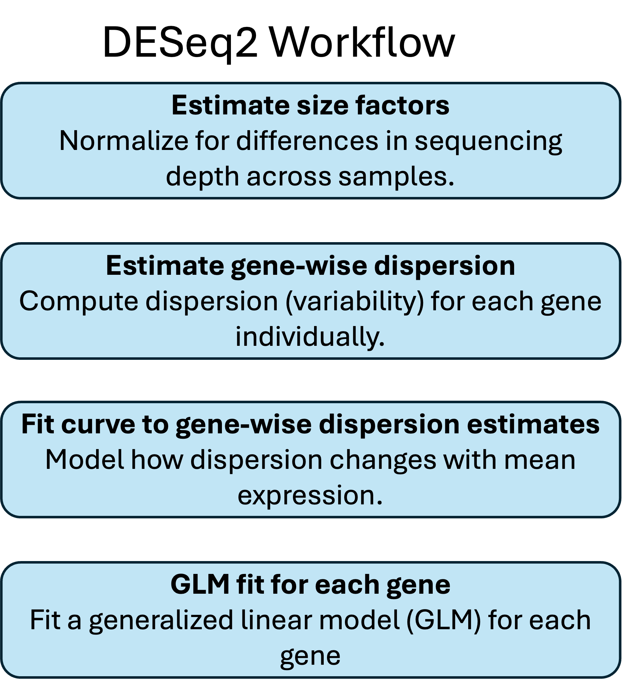
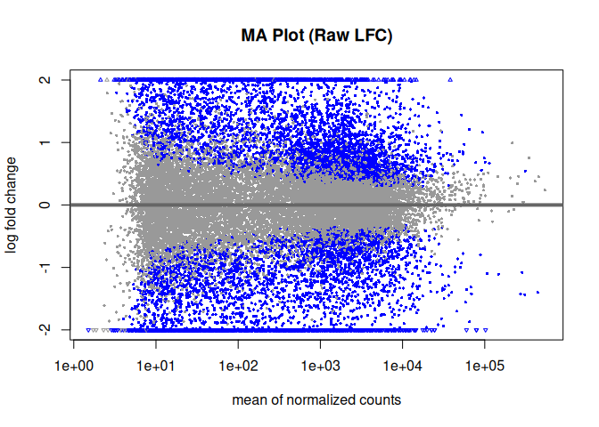
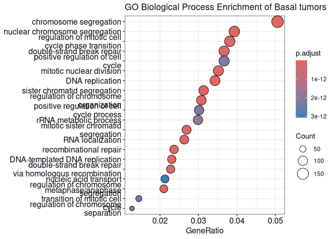
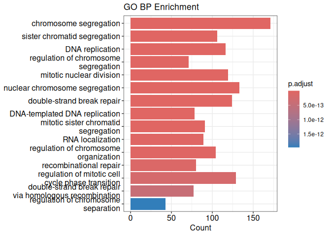
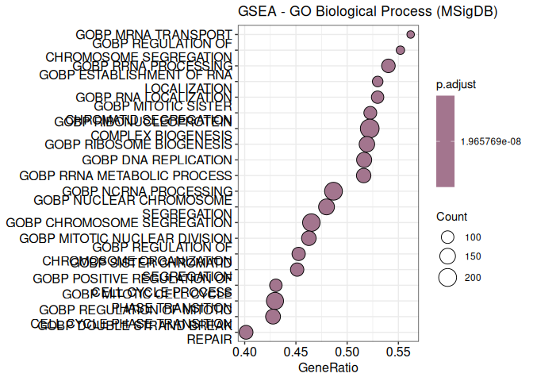
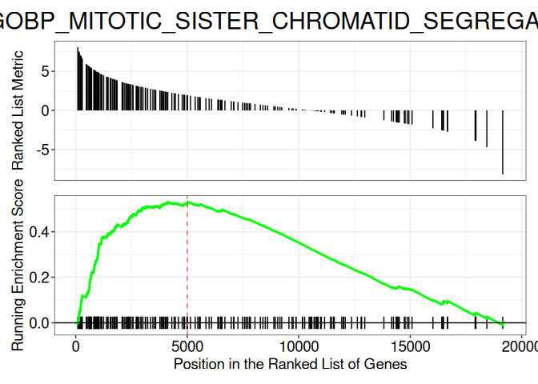

RNASeq analysis workflow
================
Michele Ceccarelli
2025-05-24

## Introduction to RNA-seq Analysis Workflow

The typical RNA-seq Analysis Workflow begins with *Data Exploration*,
where the user performs initial exploratory analyses to evaluate data
quality, perform normalization, detect outliers, assess sample
relationships (e.g., via PCA or clustering), and identify potential
batch effects. The next step is *Differential Expression*, which
involves identifying genes whose expression levels significantly differ
between experimental conditions or groups. Following this, *Gene
Annotation* is conducted to assign biological meaning to the
differentially expressed genes by mapping them to known gene names,
symbols, or functional descriptors using curated databases. Finally, the
analysis proceeds to *Functional Annotation and Gene Set Testing*, where
enriched biological pathways or gene sets (e.g. Gene Ontology) are
enriched to provide insight into the biological processes or molecular
functions associated with the observed expression changes.

<figure>

<figcaption aria-hidden="true">Workflow</figcaption>
</figure>

A *Normalization* step is needed before differential analysis to
accounted for various factors can introduce bias that can introduce
bias. - Library Size: Different samples can have different sequencing
depths, affecting total read counts. - Gene Properties: Features like
gene length, GC content, and sequence can influence how reads map to
genes. - Library Composition: Because expression is measured relatively,
a highly expressed gene can skew the apparent expression of others — a
phenomenon known as composition bias. Normalization adjusts for these
factors to make gene expression levels comparable across samples. It
typicallyinvolves two key steps: scaling and transformation. Scaling
adjusts raw counts using sample-specific size factors to account for
differences in sequencing depth. Transformation then converts scaled
data into formats like counts per million, log2 values, or Pearson
residuals to stabilize variance. While normalization removes technical
variability, it tryes preserves biological differences, enabling
accurate comparison between samples.

The primary goal of *Differential analysis* is to identify genes that
are significantly differentially expressed between the groups by
performing statistical tests for each gene independently across the `N`
genes in the dataset. The differential analysis is based os some
statistcal test that try to account for the inherent noise in the
process. Noise can arise from two broad categories: biological
variation, which reflects true differences between samples, individuals,
and groups and technical variation, which includes noise introduced
during the experimental process.

A *test statistics* is calculated as *the effect size* (difference
between treatment and control means) divided by the *standard error*
(which depends on sample variance and sample size). This statistic is
then used to derive a *p-value*, which helps assess whether observed
differences are statistically significant. The key idea is that the
statistic depends on both the magnitude of the effect and the
variability of the data, with larger sample sizes reducing uncertainty.

### DESeq2 Workflow

DESeq2, is popular R package for differential gene expression analysis
using RNA-seq count data. Its main components are

- Estimate size factors

  - This step normalizes for differences in sequencing depth across
    samples. It adjusts for varying library sizes to ensure that gene
    expression levels are comparable between samples.

- Estimate gene-wise dispersion

  - DESeq2 then estimates dispersion (biological variability) for each
    gene across replicates. Dispersion reflects how much gene expression
    varies, which is crucial for accurately modeling count data.

- Fit curve to gene-wise dispersion estimates -A smooth curve is fitted
  to the dispersion estimates as a function of mean expression. This
  models the relationship between variability and expression strength,
  allowing for a more stable inference.

- Shrink gene-wise dispersion estimates

  - Empirical Bayes shrinkage is applied to the dispersion estimates,
    borrowing strength across genes. This improves estimation,
    especially for genes with low counts or few replicates.

- GLM fit for each gene

  - Finally, a generalized linear model (GLM) is fitted for each gene
    using the estimated dispersions. This model is used to test for
    differential expression between experimental conditions (e.g.,
    treatment vs control).

<figure>

<figcaption aria-hidden="true">DESeq2</figcaption>
</figure>

*DESeq2* Normalization

- For each gene in Sample A, we take the raw read count.

- Geometric Mean Across All Samples: For each gene, compute the
  geometric mean of its read counts across all samples. This serves as a
  reference expression level for that gene.

- Ratio Calculation: For every gene in the Sample, we compute the ratio
  between gene counts the its geometric mean across samples. This
  produces a vector of ratios.

- Take the Median of Ratios: The median of all these gene-wise ratios is
  taken. This value becomes the scaling factor for Sample A.

<figure>

<figcaption aria-hidden="true">Normalization</figcaption>
</figure>

## Preparing the environment

We will use several R packages some available on CRAN which can be
installed using the `install.package()` command, some of the are
available as
<a href="https://bioconductor.org/" target="_blank">Bioconductor</a>
packages. See the corresponding pages to learn how to install.

``` r
#CRAN packages
library(ggplot2)
library(dplyr)
library(survival)
library(survminer)
#Bioconductor packages
library(DESeq2)
library(SummarizedExperiment)
library(clusterProfiler)
library(org.Hs.eg.db)
```

## Obtaining the data

In this examples we will analyze a set of bulk rnaseq samples from the
TCGA. A list of samples with associated metadata is available at
<https://github.com/ceccarellilab/Teaching/tree/main/rnaseq>. You can
download the file in your home folder, upload it on the Rstudio and read
it in R with the command `samples<-read.csv("samples_BRCA.csv")`.
Alternatively you can read it directly form the web

``` r
samples <- read.csv("https://raw.githubusercontent.com/ceccarellilab/Teaching/main/rnaseq/samples_BRCA.csv")
head(samples)
```

    ##        barcode subtype   OS vital_status
    ## 1 TCGA-A1-A0SK   Basal  967            1
    ## 2 TCGA-A1-A0SO   Basal  852            0
    ## 3 TCGA-A1-A0SP   Basal   NA            0
    ## 4 TCGA-A2-A04P   Basal  548            1
    ## 5 TCGA-A2-A04Q   Basal 2385            0
    ## 6 TCGA-A2-A04T   Basal 2246            0

You have imported a table like the one below

this is a table of TCGA barcode of breast cancer patients. We hase
selected 15 samples for each subtype (Basal, ER+, Her), clinical data
was also available form the paper in term of Overall survival and
vital_status. The data are can be directly downloaded form
<a href="https://github.com/ceccarellilab/Teaching/tree/main/rnaseq" target="_blank">
this page </a> as a SummarizedExperiment object \`data.RDS:

``` r
data <- readRDS(url("https://raw.githubusercontent.com/ceccarellilab/Teaching/main/rnaseq/data.RDS"))
```

Alternatively you can proceed to first download the file and then run
the command `data <- readRDS("data.RDS")`

This object was generated using the TCGABiolinks package to download the
samples form the genomic data commons portal
(<https://portal.gdc.cancer.gov/>) as follows. **YOU DO NOT NEED EXECUTE
THE CODE BELOW**

``` r
#CAN TAKE TIME!
#use the chunk above
library(TCGAbiolinks)
#we query the TCGA-BRCA dataset, for raw counts of the STAR protocol. The patients barcodes will allow     
query <- GDCquery(
  project = "TCGA-BRCA", #dataset
  data.category = "Transcriptome Profiling", 
  data.type = "Gene Expression Quantification", 
  workflow.type = "STAR - Counts",
  barcode = samples$barcode
)
#Now we download the data and organize the read file in a data structure called SummarizedExperiment
GDCdownload(query)
data <- GDCprepare(query)
```

the `data` is a class of the `SummarizedExperiment` package. It contains
multiple slots. One is the count matrix. Let’s extract it:

``` r
counts <- assay(data)
```

we got a matrix dimentions 60660 x 45, you can run: `dim(count)`. The
columns contain the samples

``` r
colnames(counts)
```

    ##  [1] "TCGA-A1-A0SK-01A-12R-A084-07" "TCGA-A1-A0SO-01A-22R-A084-07"
    ##  [3] "TCGA-A1-A0SP-01A-11R-A084-07" "TCGA-A2-A04P-01A-31R-A034-07"
    ##  [5] "TCGA-A2-A04Q-01A-21R-A034-07" "TCGA-A2-A04T-01A-21R-A034-07"
    ##  [7] "TCGA-A2-A04U-01A-11R-A115-07" "TCGA-A2-A0CM-01A-31R-A034-07"
    ##  [9] "TCGA-A2-A0D0-01A-11R-A00Z-07" "TCGA-A2-A0D2-01A-21R-A034-07"
    ## [11] "TCGA-A2-A0ST-01A-12R-A084-07" "TCGA-A2-A0SX-01A-12R-A084-07"
    ## [13] "TCGA-A2-A0T0-01A-22R-A084-07" "TCGA-A2-A0T2-01A-11R-A084-07"
    ## [15] "TCGA-A2-A0YE-01A-11R-A109-07" "TCGA-3C-AALI-01A-11R-A41B-07"
    ## [17] "TCGA-A2-A04W-01A-31R-A115-07" "TCGA-A2-A04X-01A-21R-A034-07"
    ## [19] "TCGA-A2-A0CX-01A-21R-A00Z-07" "TCGA-A2-A0D1-01A-11R-A034-07"
    ## [21] "TCGA-A2-A0EQ-01A-11R-A034-07" "TCGA-A2-A0T1-01A-21R-A084-07"
    ## [23] "TCGA-A2-A3XV-01A-21R-A239-07" "TCGA-A2-A3XZ-01A-42R-A239-07"
    ## [25] "TCGA-A7-A4SF-01A-11R-A266-07" "TCGA-A8-A07I-01A-11R-A00Z-07"
    ## [27] "TCGA-A8-A08B-01A-11R-A00Z-07" "TCGA-A8-A08J-01A-11R-A00Z-07"
    ## [29] "TCGA-A8-A08L-01A-11R-A00Z-07" "TCGA-A8-A08X-01A-21R-A00Z-07"
    ## [31] "TCGA-3C-AAAU-01A-11R-A41B-07" "TCGA-3C-AALJ-01A-31R-A41B-07"
    ## [33] "TCGA-3C-AALK-01A-11R-A41B-07" "TCGA-4H-AAAK-01A-12R-A41B-07"
    ## [35] "TCGA-5L-AAT0-01A-12R-A41B-07" "TCGA-5L-AAT1-01A-12R-A41B-07"
    ## [37] "TCGA-5T-A9QA-01A-11R-A41B-07" "TCGA-A1-A0SD-01A-11R-A115-07"
    ## [39] "TCGA-A1-A0SE-01A-11R-A084-07" "TCGA-A1-A0SF-01A-11R-A144-07"
    ## [41] "TCGA-A1-A0SG-01A-11R-A144-07" "TCGA-A1-A0SH-01A-11R-A084-07"
    ## [43] "TCGA-A1-A0SI-01A-11R-A144-07" "TCGA-A1-A0SJ-01A-11R-A084-07"
    ## [45] "TCGA-A1-A0SN-01A-11R-A144-07"

these are the “barcodes” of the tcga samples. Barcodes have the
following meaning 

whereas the rows contain the genes

``` r
rownames(counts)[1:20]
```

    ##  [1] "ENSG00000000003.15" "ENSG00000000005.6"  "ENSG00000000419.13"
    ##  [4] "ENSG00000000457.14" "ENSG00000000460.17" "ENSG00000000938.13"
    ##  [7] "ENSG00000000971.16" "ENSG00000001036.14" "ENSG00000001084.13"
    ## [10] "ENSG00000001167.14" "ENSG00000001460.18" "ENSG00000001461.17"
    ## [13] "ENSG00000001497.18" "ENSG00000001561.7"  "ENSG00000001617.12"
    ## [16] "ENSG00000001626.16" "ENSG00000001629.10" "ENSG00000001630.17"
    ## [19] "ENSG00000001631.16" "ENSG00000002016.18"

the count matrix contains the row counts:

``` r
head(counts[,1:10])
```

the SummarizeExperiment also contains some other features associated to
the samples in the slot `colData`

``` r
coldata <- as.data.frame(colData(data))
```

we can add the subtype that we got from the `samples` table in the
coldata

``` r
coldata$subtype <- as.factor(samples$subtype)
table(coldata$subtype)
```

    ## 
    ## Basal    ER   Her 
    ##    15    15    15

If you want to explore the metadata table you can use the `View` command
in Rstudio

``` r
View(coldata)
```

## DESeq workflow

We will use the DESeq2 workflow in thie exercise. DESeq2 provides
methods to test for differential expression by use of negative binomial
generalized linear models. DESeq2 models RNA-seq data using the Negative
Binomial distribution, which includes *dispersion*. The dispersion
measures the variability of gene expression beyond what is expected from
a Poisson distribution. The variance is given by Var(X) = mu + alpha \*
mu^2. The first term comes from the Poisson component. The second term
models biological variability. A higher dispersion means more
variability between replicates of the same condition. Dispersion is
estimated per gene, reflecting how much the gene’s expression varies
across replicates. Fits a negative binomial GLM model using the *design
matrix*.

The command below takes in input the `counts` gene expression count
matrix (genes × samples), the metadata `coldata` and a design matrix
(`0 ~ subtype`). If tou want to learn more about design matrices for
generalized linear models please read
<a href="https://master.bioconductor.org/packages/release/workflows/vignettes/RNAseq123/inst/doc/designmatrices.html" target="_blank">this
tutorial</a>. In particular with the command below the design matrix in
a one-hot encoding of the factor. Each sample gets a 1 in the column
corresponding to its subtype and 0 elsewhere. You could give the command
`model.matrix(~ 0 + coldata$subtype)` to see the matrix.

``` r
d <- DESeqDataSetFromMatrix(countData = counts,
                              colData = coldata,
                              design = ~ 0 + subtype)
```

### Filtering low expressed genes

let’ first remove low expressed genes. We have 45 samples and 60660
genes. Suppose we select genes that having at least **15 counts** in at
least \_5 samples\_\_.

``` r
keep <- rowSums(counts(d) >= 15) >= 5
d <- d[keep, ]
sum(keep)
```

    ## [1] 23307

we remain with 23307 genes.

### Run the the DESeq2 pipeline

The complete pipeline is execure in just one command. Estimates size
factors (normalization). Estimates dispersions (variance). Fits a
negative binomial GLM model using the design (`~ 0 + subtype`). Prepares
`d` for contrast-based differential expression testing using
`results()`.

``` r
d <- DESeq(d)
```

    ## estimating size factors

    ## estimating dispersions

    ## gene-wise dispersion estimates

    ## mean-dispersion relationship

    ## final dispersion estimates

    ## fitting model and testing

    ## -- replacing outliers and refitting for 1337 genes
    ## -- DESeq argument 'minReplicatesForReplace' = 7 
    ## -- original counts are preserved in counts(dds)

    ## estimating dispersions

    ## fitting model and testing

let’s plot is the distribution of the counts:

``` r
logcounts <- log2(counts(d, normalized = FALSE) + 1)
boxplot(logcounts)
```

<!-- --> and
the distribution of the normalized counts.

``` r
logNormCounts <-log2(counts(d, normalized = TRUE) + 1)
boxplot(logNormCounts)
```

<!-- -->

### Dispersion plot

``` r
# Dispersion plot
plotDispEsts(d)
```

<!-- --> \###
PCA We can plot our samples over a lower-dimentional space using PCA.
Before applying the PCA we need to perform a *variance stabilization*
because PCA assumes that all features contribute equally to variance.
However, in raw RNA-seq data high-count genes dominate PCA, while
low-count genes and Variance scales with expression level, distorting
distances between samples. The `vst` transformation makes gene variances
independent of their expression level, ensures both low- and
high-expression genes influence PCA, improve interpretability.

``` r
vst<-vst(d)
plotPCA(vst, intgroup = "subtype") 
```

<!-- -->

### Basal specific genes

Now let’s us select the results of the differential analysis. We compare
the average expression in “Basal” to the average of “ER” and “Her” for
every gene. The first command `contrast_basal <- c(1, -0.5, -0.5)`
assumes that the first column of the design matrix is corresponds to the
“Basal” subtype, the second to the “ER” and the third to the “Her”. You
can verify running `model.matrix(~ 0 + subtype, data = colData(d))`.
Just because the levels of the subtype factors as ordered as follos
Basal, ER, Her.

``` r
contrast_basal <- c(1, -0.5, -0.5)
res_basal <- results(d, 
                     contrast = contrast_basal,
                     alpha = 0.05
)

summary(res_basal)
```

    ## 
    ## out of 23307 with nonzero total read count
    ## adjusted p-value < 0.05
    ## LFC > 0 (up)       : 4612, 20%
    ## LFC < 0 (down)     : 3767, 16%
    ## outliers [1]       : 0, 0%
    ## low counts [2]     : 0, 0%
    ## (mean count < 2)
    ## [1] see 'cooksCutoff' argument of ?results
    ## [2] see 'independentFiltering' argument of ?results

we got ~4208 up and 3535 downregulated genes. We can be more stringent
by defining a cutoff on the fold change. We can plot how the fold-change
and expression are related in the Differentially expressed genes

``` r
plotMA(res_basal, ylim = c(-2, 2), alpha = 0.05, 
        main = "MA Plot (Raw LFC)")
```

<!-- -->

If we wanted to perform *pairwise comparison*, the command could be
simply:

``` r
res_basal_vs_ER <- results(
    d, 
    contrast = c("subtype", "Basal", "ER"),  # Compare Basal vs. ER
    alpha = 0.05
)
summary(res_basal_vs_ER)
```

### Annotation of the results

Our results tabale looks as follows:

``` r
head(res_basal)
```

    ## log2 fold change (MLE): +1,-0.5,-0.5 
    ## Wald test p-value: +1,-0.5,-0.5 
    ## DataFrame with 6 rows and 6 columns
    ##                      baseMean log2FoldChange     lfcSE      stat    pvalue
    ##                     <numeric>      <numeric> <numeric> <numeric> <numeric>
    ## ENSG00000000003.15 3062.09486       0.572666  0.267107  2.143961 0.0320360
    ## ENSG00000000005.6     9.67242      -0.555985  0.587776 -0.945913 0.3441929
    ## ENSG00000000419.13 2435.82163       0.365685  0.191467  1.909909 0.0561450
    ## ENSG00000000457.14 1179.83407      -0.435856  0.189515 -2.299849 0.0214568
    ## ENSG00000000460.17  621.59608       0.542008  0.232435  2.331870 0.0197075
    ## ENSG00000000938.13  500.02134       0.568789  0.284195  2.001401 0.0453491
    ##                         padj
    ##                    <numeric>
    ## ENSG00000000003.15 0.0794238
    ## ENSG00000000005.6  0.4861892
    ## ENSG00000000419.13 0.1239436
    ## ENSG00000000457.14 0.0575746
    ## ENSG00000000460.17 0.0538102
    ## ENSG00000000938.13 0.1045349

We now annotate the resuls with gene names. We have multiple options. We
will use the `bitr` command in the ClusterProfiler package. Before
applying `bitr` we remove the dangling part (the version) after the “.”
in the genames

``` r
res_basal_df <- as.data.frame(res_basal)
#remove everything after the "."
res_basal_df$ENSEMBL <- sub("\\..*$", "", rownames(res_basal_df)) 

# Map ENSEMBL → SYMBOL using clusterProfiler::bitr
id_mapping <- bitr(
  res_basal_df$ENSEMBL,
  fromType = "ENSEMBL", #original annotation
  toType = "SYMBOL", #required mapping
  OrgDb = org.Hs.eg.db
)
```

    ## 'select()' returned 1:many mapping between keys and columns

    ## Warning in bitr(res_basal_df$ENSEMBL, fromType = "ENSEMBL", toType =
    ## "SYMBOL", : 18.14% of input gene IDs are fail to map...

``` r
# Merge mapped SYMBOLs
res_basal_df <- merge(res_basal_df, id_mapping, by = "ENSEMBL")

# sort according to the stat
res_basal_df <- res_basal_df %>%
  arrange(desc(stat))
head(res_basal_df,n=20)
```

    ##            ENSEMBL   baseMean log2FoldChange     lfcSE     stat
    ## 1  ENSG00000154548  152.42081       4.590050 0.3098403 14.81424
    ## 2  ENSG00000054598 2721.31233       4.715138 0.3327376 14.17074
    ## 3  ENSG00000272620  429.90462       6.460033 0.4640934 13.91968
    ## 4  ENSG00000203688  131.63664       5.832416 0.4636387 12.57966
    ## 5  ENSG00000184599  125.66594       5.186985 0.4428384 11.71304
    ## 6  ENSG00000143452  242.22933       6.382076 0.5483568 11.63855
    ## 7  ENSG00000154655  253.81964       2.991926 0.2636037 11.35009
    ## 8  ENSG00000225194   73.07928       5.126034 0.4619657 11.09614
    ## 9  ENSG00000225194   73.07928       5.126034 0.4619657 11.09614
    ## 10 ENSG00000146281 1039.87071       3.431217 0.3171791 10.81792
    ## 11 ENSG00000005513  259.02940       4.075835 0.3768515 10.81549
    ## 12 ENSG00000167614  975.50030       4.798532 0.4485152 10.69871
    ## 13 ENSG00000174607  938.74391       5.242621 0.4903540 10.69150
    ## 14 ENSG00000146013  130.97143       5.020818 0.4757219 10.55410
    ## 15 ENSG00000114547  435.72205       5.615879 0.5330763 10.53485
    ## 16 ENSG00000072041  331.79698       8.094986 0.7733165 10.46788
    ## 17 ENSG00000213064 6365.66270       1.776989 0.1699732 10.45453
    ## 18 ENSG00000103355   32.59448       6.634163 0.6374974 10.40657
    ## 19 ENSG00000065371  363.61674       6.516547 0.6379889 10.21420
    ## 20 ENSG00000112242 2043.70637       1.494583 0.1467297 10.18596
    ##          pvalue         padj       SYMBOL
    ## 1  1.185151e-49 1.381116e-45       SRSF12
    ## 2  1.390294e-45 1.080119e-41        FOXC1
    ## 3  4.810261e-44 2.242255e-40    AFAP1-AS1
    ## 4  2.732128e-36 7.075302e-33    LINC02487
    ## 5  1.092860e-31 1.959329e-28        TAFA3
    ## 6  2.624525e-31 4.369272e-28      HORMAD1
    ## 7  7.408691e-30 1.015732e-26      L3MBTL4
    ## 8  1.309839e-28 1.327323e-25    LINC00092
    ## 9  1.309839e-28 1.327323e-25 LOC105376159
    ## 10 2.831449e-27 2.336494e-24       PM20D2
    ## 11 2.907209e-27 2.336494e-24         SOX8
    ## 12 1.032100e-26 7.759726e-24        TTYH1
    ## 13 1.115491e-26 8.124612e-24         UGT8
    ## 14 4.862605e-26 3.333316e-23        GFRA3
    ## 15 5.967858e-26 3.863691e-23       ROPN1B
    ## 16 1.213281e-25 7.642685e-23      SLC6A15
    ## 17 1.396937e-25 8.348309e-23       SFT2D2
    ## 18 2.314007e-25 1.348314e-22       PRSS33
    ## 19 1.712843e-24 9.505057e-22        ROPN1
    ## 20 2.290984e-24 1.241766e-21         E2F3

There are multiple genes known to be associated with the Basal subtype.
FOXC1 is a aaster regulator of basal-like breast cancer (TNBC) and other
aggressive carcinomas, it drives EMT, invasion, and chemoresistance.
HORMAD1 is overexpressed in basal-like breast cancer and linked to
genomic instability and immune evasion. SOX8 is a member of the SOX
family, implicated in basal-like and triple-negative breast cancer
(TNBC), associated with stemness and poor prognosis. CLDN6 (Claudin-6),
tight junction protein often dysregulated in basal-like cancers, may
correlate with metastasis. E2F3 is transcription factor linked to cell
cycle progression and basal-like tumors.

### DEGs

Let filter by pvalue and effect size to select differentially expressed
genes.

``` r
res_basal_sig <- res_basal_df %>%
  filter(padj < 0.05 & stat > 2)
dim(res_basal_sig)
```

    ## [1] 4093    8

we got 4093 up-regulated genes. If we wanted both up-and down-regulated
genes we could have used `abs(stat)>2` as filter.

### Functional Annotation: Gene Ontology Enrichment

We can use the functions of the ClusterProfiler to perform
over-reprepresentation analysis (Fisher’s test). We will use the
`enrichGO` function of the ClusterProfiler package. We will give the
list of up-regulated genes which where selected in the ’res_basal_sig\`
data.frame

``` r
ego <- enrichGO(
  gene          = res_basal_sig$ENSEMBL, #the list of DE genes
  OrgDb         = org.Hs.eg.db, # the organisms (background) 
  keyType       = "ENSEMBL", #annotation of the list
  ont           = "BP",  # The ontology we want to use ("MF" or "CC" are also available) 
  pAdjustMethod = "BH", # Multiple test asjustment method
  pvalueCutoff  = 0.01, # Cutoff on the p-value 
  qvalueCutoff  = 0.05 # Cutoff on the q-value
)
```

We can inspect the results in Rstudio with:

``` r
View(ego@result)
```

We can also plot the results, for example the first 20 Gene Ontology
terms with a `dotplot`

``` r
dotplot(ego, showCategory = 20) + ggtitle("GO Biological Process Enrichment of Basal tumors")
```

<!-- --> Or
with a `barplot`

``` r
barplot(ego, showCategory = 15, title = "GO BP Enrichment", sortBy = "pvalue")
```

<!-- -->

we can also use Gene Set Enrichment Analysys. In this case we will
enrich the the complete, unfiltered list, of *Wald statistics* which is
the fold change over the standard error (log2FoldChange/lfcSE). This
list will be enriched with a *gene set* that we can download from the
broad. Remeber we have already ordered the `res_basal_df` data.frame.

``` r
geneList <- res_basal_df$stat # wald test values 
names(geneList) <- res_basal_df$SYMBOL # gene names associated to the values 
geneList<-geneList[!duplicated(names(geneList))] # remove duplicates
#Download the gene set c5 (Gene Ontology) Biological Process from the Broad 
term2gene<-read.gmt("https://data.broadinstitute.org/gsea-msigdb/msigdb/release/2023.1.Hs/c5.go.bp.v2023.1.Hs.symbols.gmt")

#perform the GSEA enrichment analysys
gsea_go <- GSEA(
  geneList     = geneList, #sorted gene list
  TERM2GENE    = term2gene, #the gene set
  pvalueCutoff = 0.05,
  verbose      = FALSE
)
```

    ## Warning in preparePathwaysAndStats(pathways, stats, minSize, maxSize, gseaParam, : There are ties in the preranked stats (0.96% of the list).
    ## The order of those tied genes will be arbitrary, which may produce unexpected results.

    ## Warning in fgseaMultilevel(pathways = pathways, stats = stats, minSize =
    ## minSize, : For some of the pathways the P-values were likely overestimated.
    ## For such pathways log2err is set to NA.

    ## Warning in fgseaMultilevel(pathways = pathways, stats = stats, minSize =
    ## minSize, : For some pathways, in reality P-values are less than 1e-10. You
    ## can set the `eps` argument to zero for better estimation.

We can plot the results as dotplot

``` r
dotplot(gsea_go, 
        showCategory = 20, 
        title = "GSEA - GO Biological Process (MSigDB)"
)
```

<!-- --> as a
*ridgeplot*

``` r
ridgeplot(gsea_go, showCategory = 15)
```

    ## Picking joint bandwidth of 0.484

<!-- -->

or we can plot individual categories

``` r
gseaplot(gsea_go, geneSetID = 3, title = gsea_go$Description[3])
```

<!-- -->

# Survival Analysis

Our `samples` table contain the survival information of our samples. We
can use the data to create a `Surv` data structure from the `survival`
library, and fit a a Kaplan-Meier survival curve for each subtype.

``` r
surv <- Surv(samples$OS,samples$vital_status)
fit <- survfit(surv ~ subtype, data = samples)
summary(fit)
```

    ## Call: survfit(formula = surv ~ subtype, data = samples)
    ## 
    ## 3 observations deleted due to missingness 
    ##                 subtype=Basal 
    ##  time n.risk n.event survival std.err lower 95% CI upper 95% CI
    ##   255     14       1    0.929  0.0688        0.803            1
    ##   548     12       1    0.851  0.0973        0.680            1
    ##   754     10       1    0.766  0.1191        0.565            1
    ##   967      8       1    0.670  0.1374        0.448            1
    ## 
    ##                 subtype=ER 
    ##      time n.risk n.event survival std.err lower 95% CI upper 95% CI
    ## 
    ##                 subtype=Her 
    ##  time n.risk n.event survival std.err lower 95% CI upper 95% CI
    ##    30     15       1    0.933  0.0644        0.815            1
    ##  1127      9       1    0.830  0.1133        0.635            1

and plot the curves using the `ggsurvplot` in the `survminer` package.

``` r
p<-ggsurvplot(
  fit,
  pval = TRUE,
  risk.table = FALSE,
  palette = c("darkred", "darkgreen", "steelblue"),
  title = "Overall Survival by Breast Cancer Subtype",
  legend.title = "Subtype",
  legend.labs = c("TNBC", "HER2+", "ER+")
)
p
```

<!-- -->

# Now it is your turn

## Exercise 1. ER+ breast cancer

Try to perform the same analysis extractinf the genes upregulated in the
ER-positive brest bancer

## Exercise 2.

Draw a *Volcano Plot*, it is a scatterplot with the fold change on the
*x* axis and -log(p-value) on the *y* axis. One point for every gene.
try to color the DEGs in red and the other in gray as follows:

<!-- -->
