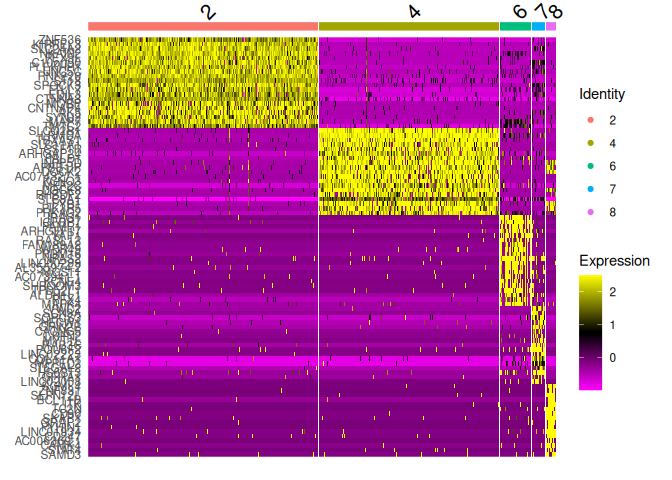
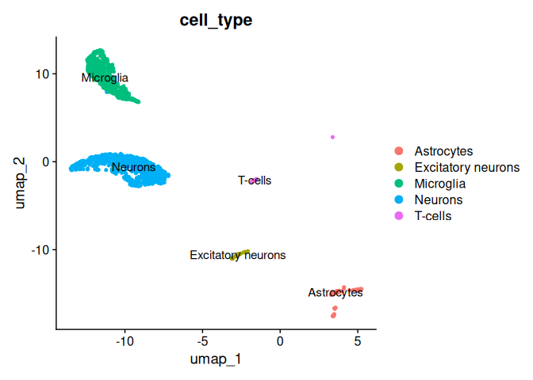

scExample
================
Michele Ceccarelli
2025-06-01

## Setup the environment

``` r
library(SCEVAN)
library(Seurat)
library(dplyr)
library(readxl)
library(data.table)
```

## Load the Data

We use a glioblastoma sample (NH17-161) form the study
<a href="https://www.ncbi.nlm.nih.gov/geo/query/acc.cgi?acc=GSE211376" target="_blank">
GSE211376</a>.

``` r
count_mtx <- fread("https://github.com/ceccarellilab/CancerBioinformaticsCourse/raw/refs/heads/main/scRNASeq/sample_NH17-161_GSE211376.csv.gz")
count_mtx <- as.data.frame(count_mtx)
rownames(count_mtx)<- count_mtx$V1
count_mtx$V1 <- NULL
```

## Infer copy number and tumor normal classification

We can use
<a target="_blank" href="https://github.com/AntonioDeFalco/SCEVAN">
SCEVAN</a> to classify tumor/normal cells.

<figure>

<figcaption aria-hidden="true">SCEVAN workflow</figcaption>
</figure>

*SCEVAN* starts from the raw count matrix removing irrelevant genes and
cells. *a* Identification of a small set of highly confident normal
cells. *b* Relative gene expression obtained from removal of the
baseline inferred from confident normal cells. *c* Edge-preserving
nonlinear diffusion filtering of relative gene expression. *d*
Segmentation with a variational region-growing algorithm. *e*
Identification of normal cells as those in the cluster containing the
majority of confident normal cells. *f* Identification of possible
subclones using Louvain clustering applied to a shared nearest-neighbor
graph of the tumor cells. *g* Segmentation with a variational
region-growing algorithm applied to each subclone. Segments are then
classified in five copy number states. *h* Analysis of subclones
including clone tree, pathway activities (GSEA was performed for each
subclone using fgseaMultilevel which calculates P values based on an
adaptive multilevel splitting Monte Carlo scheme), and characterization
of shared and specific alterations.

``` r
#CAN TAKE THREE-FIVE MINUTES
results <-  SCEVAN::pipelineCNA(
  count_mtx = count_mtx, 
  sample = "NH17-161", 
  par_cores = 36, 
  SUBCLONES = FALSE, 
  plotTree = TRUE
)
```

    ## [1] " raw data - genes: 27102 cells: 4357"
    ## [1] "1) Filter: cells > 200 genes"
    ## [1] "2) Filter: genes > 10% of cells"
    ## [1] "8687 genes past filtering"
    ## [1] "3) Annotations gene coordinates"
    ## [1] "found 30 confident non malignant cells"
    ## [1] "7739 genes annotated"
    ## [1] "4) Filter: genes involved in the cell cycle"
    ## [1] "7367 genes past filtering "
    ## [1] "5)  Filter: cells > 5genes per chromosome "
    ## [1] "6) Log Freeman Turkey transformation"
    ## [1] "A total of 4352 cells, 7367 genes after preprocessing"
    ## [1] "7) Measuring baselines (confident normal cells)"
    ## [1] "8) Smoothing data"
    ## [1] "9) Segmentation (VegaMC)"
    ## [1] "10) Adjust baseline"
    ## [1] "11) plot heatmap"

    ## [1] "found 2898 tumor cells"
    ## [1] "time classify tumor cells:  2.66238601605097"

``` r
saveRDS(results, file = "resultSCEVAN_N17-161.RDS")
```

### Tumor/Normal classification

``` r
results<- readRDS(url("https://github.com/ceccarellilab/CancerBioinformaticsCourse/raw/refs/heads/main/scRNASeq/resultSCEVAN_N17-161.RDS"))
table(results[[1]])
```

    ## 
    ## filtered   normal    tumor 
    ##        5     1454     2898

In the `output` folder you can finde the images `NH17-161heatmap.png`
and `NH17-161_coarse-grainedClonalCNProfile.png` containing the
tumor/normal classification and the detected copy number profiles.


## Seurat Object

``` r
type <-  select(results,"class") 

# 1. Create Seurat object
seurObj <- CreateSeuratObject(counts = count_mtx) 
```

    ## Warning: Data is of class data.table. Coercing to dgCMatrix.

``` r
seurObj<-  AddMetaData(seurObj,type,col.name = "type")
```

``` r
# 2. Quality control — compute basic metrics
seurObj[["percent.mt"]] <- PercentageFeatureSet(seurObj, pattern = "^MT-")  

# 3. Visualize QC metrics before filtering
VlnPlot(seurObj, features = 
       c("nFeature_RNA", "nCount_RNA", "percent.mt"), 
        ncol = 3)
```

    ## Warning: Default search for "data" layer in "RNA" assay yielded no results;
    ## utilizing "counts" layer instead.

<!-- -->

``` r
# 4. Filter cells based on QC metrics
seurObj <- subset(seurObj,  
                  subset = nFeature_RNA > 200 & 
                    nFeature_RNA < 6000 & 
                    percent.mt < 5
)
dim(seurObj)
```

    ## [1] 27102  4328

``` r
# 5. Filter genes (optional but often used)
# Remove genes expressed in very few cells (e.g., < 1% cells)
counts <- GetAssayData(seurObj, assay = "RNA", layer = "counts")

keep_genes <- rowSums(counts > 0) >= 0.01 * ncol(seurObj)
sum(keep_genes)
```

    ## [1] 17166

``` r
seurObj <- subset(seurObj, features = names(keep_genes[keep_genes]))
dim(seurObj)
```

    ## [1] 17166  4328

``` r
# 6. Normalize and continue analysis
set.seed(123)
# Step 6.1 Normization
seurObj <- NormalizeData(seurObj) 
```

    ## Normalizing layer: counts

``` r
# Step 6.2 select the most informative genes
seurObj <-  FindVariableFeatures(seurObj) 
```

    ## Finding variable features for layer counts

``` r
# Step 6.3 scale data
seurObj <-  ScaleData(seurObj)
```

    ## Centering and scaling data matrix

``` r
# Steps 6.4 -6.7 (PCA, nearest neghrbors, leoven clusters, UMAP)
seurObj <-  RunPCA(seurObj) 
```

    ## PC_ 1 
    ## Positive:  KAZN, DLGAP1, GRIA4, FRMD5, SGCD, GRIK2, PCDH7, DGKB, TNIK, TMEM108 
    ##     EPHB1, NFASC, TMEM163, AC004852.2, KCNIP4, PDZRN3, LRRTM4, FIGN, ATRNL1, CACNA2D1 
    ##     KCND2, TSC22D1, XKR4, CADPS, DCC, DCLK2, NTRK2, PKP4, TMEFF2, BAALC 
    ## Negative:  LRMDA, SLCO2B1, DOCK2, INPP5D, DOCK8, TBXAS1, ARHGAP15, APBB1IP, CSF1R, SFMBT2 
    ##     SLC11A1, KCNQ3, MAML3, PIK3R5, AC074327.1, FYB1, PLXDC2, ATP8B4, RCSD1, IRAK3 
    ##     MYO1F, HCLS1, DENND3, SYK, RHBDF2, PALD1, LYN, FLI1, BNC2, WDFY4 
    ## PC_ 2 
    ## Positive:  NKAIN2, KIRREL3, SLC24A2, UNC5C, SPOCK3, C10orf90, CNTNAP4, MAP7, TMEM144, MOBP 
    ##     AK5, ENPP2, PEX5L, RNF220, ST18, SYNJ2, SH3GL3, PLEKHH1, PCSK6, PIEZO2 
    ##     CLMN, RAPGEF5, MBP, FGFR2, MAN2A1, MYO1D, SLCO3A1, TTLL7, MOG, TF 
    ## Negative:  DLGAP1, KCND2, ATRNL1, AC004852.2, SNTG1, EGFR, UST, TNS3, DCLK2, ZNF804A 
    ##     GRIK2, NKAIN3, TMEM163, PDZRN3, PCDH7, BRINP3, KCNIP4, SLC8A1, XKR4, LRRTM4 
    ##     DGKB, EPHB1, CADPS, MIR9-1HG, PITPNC1, PALLD, PRRX1, BAALC, GPC6, CSMD3 
    ## PC_ 3 
    ## Positive:  TNS3, SEMA5B, GPR17, FERMT1, BCAS1, BMPER, C11orf58, PKP4, SLIT1, ADAMTSL1 
    ##     AC006058.1, CRB1, BRINP2, GRIK2, SGCD, P2RX7, UST, SOX4, KHDRBS3, SH3RF3 
    ##     SLC16A10, PPP1R16B, GRIA4, ANO3, AL359091.1, ENPP6, PRKG2, TMEM132B, GNG2, KCNS3 
    ## Negative:  KCNN3, DCLK1, EEPD1, ARHGEF4, RGMA, TENM4, ADGRV1, SPARCL1, GFAP, RFX4 
    ##     SLC4A4, LHFPL6, TNC, LIFR, PTCHD1-AS, ALDH1L1, ABLIM1, NEBL, ARHGEF17, FAM189A2 
    ##     DTNA, OBI1-AS1, DAPK1, CLU, ROBO2, IGFBP7, ANKFN1, WDR49, AQP4, MIR99AHG 
    ## PC_ 4 
    ## Positive:  PARD3B, SH3RF3, ENPP6, BMPER, TCF7L2, CRB1, KCNS3, AC006058.1, RASGEF1B, BCAS1 
    ##     GPR17, LINC01088, PKP4, EPB41L2, TNS3, PPP1R16B, SEMA5B, GFPT2, MGAT4C, FRMD5 
    ##     FRMD6, P2RX7, AL359091.1, TRPM3, TMEM132B, AC008080.4, CADPS, ADAMTSL1, TPD52L1, MOB3B 
    ## Negative:  TMEM132C, SNTG1, KCND2, ETV1, KCNIP1, SEZ6L, BRINP3, MYT1, GRM5, FREM2 
    ##     CSMD3, CDH10, SLC8A1, SLC24A3, NTNG1, AC019068.1, SHISA9, MT3, SORCS3, IGSF21 
    ##     FGFR1, STXBP5L, ST8SIA1, ST6GAL1, NKAIN3, MIR9-1HG, AC004852.2, NOVA1-DT, KIF26B, EGFR 
    ## PC_ 5 
    ## Positive:  LRIG1, MYO16, GRIA1, EEPD1, PLXNA4, TNIK, LRFN2, GLIS3, AC124254.1, MASP1 
    ##     ROBO2, RIT2, DACH1, IGSF11, FIGN, GFAP, MIR99AHG, DMD, RGMA, ARHGEF26 
    ##     GALR1, FRMD5, ID3, TMEM132B, PACRG, TMEM108, EPHB1, DOCK7, DCLK1, CNR1 
    ## Negative:  TPD52L1, MGAT4C, TRPM3, NRG3, IRAG1, PAMR1, PRKG1, SYNPO2, NPAS2, MGST1 
    ##     TMEM132C, FGFR1, YAP1, MYT1, GPC5, GRM5, SHROOM3, CNTN1, PLXNA2, LINC00299 
    ##     ABI3BP, LRAT, RYR3, CSRP2, ETNPPL, GMPR, EFNA5, SLC7A2, XYLT1, KCNE4

``` r
seurObj <-  FindNeighbors(seurObj,dims = 1:20) 
```

    ## Computing nearest neighbor graph

    ## Computing SNN

``` r
seurObj <-  FindClusters(seurObj,resolution = 0.2) 
```

    ## Modularity Optimizer version 1.3.0 by Ludo Waltman and Nees Jan van Eck
    ## 
    ## Number of nodes: 4328
    ## Number of edges: 150851
    ## 
    ## Running Louvain algorithm...
    ## Maximum modularity in 10 random starts: 0.9499
    ## Number of communities: 10
    ## Elapsed time: 0 seconds

``` r
seurObj <-  RunUMAP(seurObj, dims = 1:20)
```

    ## 12:10:54 UMAP embedding parameters a = 0.9922 b = 1.112

    ## 12:10:54 Read 4328 rows and found 20 numeric columns

    ## 12:10:54 Using Annoy for neighbor search, n_neighbors = 30

    ## 12:10:54 Building Annoy index with metric = cosine, n_trees = 50

    ## 0%   10   20   30   40   50   60   70   80   90   100%

    ## [----|----|----|----|----|----|----|----|----|----|

    ## **************************************************|
    ## 12:10:54 Writing NN index file to temp file /tmp/RtmpnFYK0q/file35eb1c660e3a97
    ## 12:10:54 Searching Annoy index using 1 thread, search_k = 3000
    ## 12:10:55 Annoy recall = 100%
    ## 12:10:56 Commencing smooth kNN distance calibration using 1 thread with target n_neighbors = 30
    ## 12:10:59 Initializing from normalized Laplacian + noise (using RSpectra)
    ## 12:10:59 Commencing optimization for 500 epochs, with 174288 positive edges
    ## 12:10:59 Using rng type: pcg
    ## 12:11:04 Optimization finished

``` r
# Optional: plot UMAP
DimPlot(seurObj, reduction = "umap", label = TRUE)
```

<!-- -->

``` r
DimPlot(object = seurObj, reduction = "umap", 
              group.by = "type",
        cols = c("gray", "darkgreen", "darkred"))
```

<!-- -->

Now we use the signatures of
<a href=https://pubmed.ncbi.nlm.nih.gov/31327527/" target = "_blank">
Neftel et al. </a> to classify the tumor cell subtypes.

``` r
geneSet<- read_xlsx("netftel_sign.xlsx" )
geneSet<-as.list(na.omit(geneSet))
seurObj <- AddModuleScore(seurObj, features = geneSet, name = names(geneSet))
```

    ## Warning: The following features are not present in the object: ADM, WARS, ERO1L,
    ## not searching for symbol synonyms

    ## Warning: The following features are not present in the object: CHI3L1, S100A10,
    ## C8orf4, not searching for symbol synonyms

    ## Warning: The following features are not present in the object: PCDHGC3, not
    ## searching for symbol synonyms

    ## Warning: The following features are not present in the object: SOX2-OT, LPPR1,
    ## PCDHGC3, not searching for symbol synonyms

    ## Warning: The following features are not present in the object: TUBB3, CD24,
    ## FXYD6, HN1, not searching for symbol synonyms

    ## Warning: The following features are not present in the object: STMN2, CD24,
    ## HMP19, TUBB3, DLX6-AS1, DLX5, HN1, SEPT3, not searching for symbol synonyms

    ## Warning: The following features are not present in the object: KIAA0101,
    ## HIST1H4C, MLF1IP, RNASEH2A, FEN1, ZWINT, not searching for symbol synonyms

    ## Warning: The following features are not present in the object: CCNB1, CDC20,
    ## TROAP, KIF20A, ARL6IP1, SPAG5, not searching for symbol synonyms

``` r
cellTypes <- names(geneSet)
#needed because AddModuleScore  appends a number (1, 2, etc.) to each 
#score name  
n = ncol(seurObj@meta.data)
m = length(cellTypes)
#View(seurObj@meta.data)
colnames(seurObj@meta.data)[n]<- cellTypes[m]
colnames(seurObj@meta.data)[n-1]<- cellTypes[m-1]
colnames(seurObj@meta.data)[n-2]<- cellTypes[m-2]
colnames(seurObj@meta.data)[n-3]<- cellTypes[m-3]
colnames(seurObj@meta.data)[n-4]<- cellTypes[m-4]
colnames(seurObj@meta.data)[n-5]<- cellTypes[m-5]
colnames(seurObj@meta.data)[n-6]<- cellTypes[m-6]
colnames(seurObj@meta.data)[n-7]<- cellTypes[m-7]

#View(seurObj@meta.data)
#You could get the same result with:
#for (i in c(m:1)) {
#  colnames(seurObj@meta.data)[n-i+1] <-  cellTypes[m-i+1]
#}
  
#colnames(seurObj@meta.data)[(ncol(seurObj@meta.data)-length(names(geneSet))+1):ncol(seurObj@meta.data)] <- cellTypes

#select the metadata table of malignant cells 
maligant_cells <- filter(seurObj@meta.data, type == "tumor") 
subtype_scores <- select(maligant_cells, all_of(cellTypes)) 

#classify each malignant cell accorting to the maximum score among cell states
class_mal <- apply(subtype_scores, 1, function(x) cellTypes[which.max(x)])

#add this information to the metadata
seurObj <- AddMetaData(seurObj, metadata = class_mal, col.name = "cell_type_mal")


tumor_colors <- c("darkgreen", "yellow", "orange", "red", "darkred", "darkblue", "blue", "lightblue")
names(tumor_colors)<- sort(cellTypes)
Seurat::DimPlot(seurObj,group.by =  "cell_type_mal", cols =
                  tumor_colors)
```

<!-- -->

``` r
normal_clusters <- c(8,7,4,2,6)
seurObj_norm <- subset(seurObj, idents = normal_clusters)
dim(seurObj_norm)
```

    ## [1] 17166  1477

``` r
# Step 2: Run FindAllMarkers on this subset
markers_normal <- FindAllMarkers(seurObj_norm, 
                             only.pos = TRUE,  # Only  upregulated markers
                             test.use = "wilcox",     #  wilcox, MAST, DESeq2, etc.
                             logfc.threshold = 0.25,  # Default log-fold-change threshold
                             min.pct = 0.1)      
```

    ## Calculating cluster 2

    ## Calculating cluster 4

    ## Calculating cluster 6

    ## Calculating cluster 7

    ## Calculating cluster 8

``` r
top_markers <- markers_normal %>%
  group_by(cluster) %>%
  top_n(n = 20, wt = -p_val_adj) 
#View(top_markers)
```

``` r
DoHeatmap(seurObj_norm, features = top_markers$gene) 
```

    ## Warning in DoHeatmap(seurObj_norm, features = top_markers$gene): The following
    ## features were omitted as they were not found in the scale.data slot for the RNA
    ## assay: CCDC88C, ACAP1, ITGA4, IKZF3, RNF165, CACNG4, IGSF9B, CELF2

<!-- -->

``` r
#cluster 2 --> "Neurons"
p1<-FeaturePlot(seurObj_norm,features = "KIRREL3")
#cluster 4 --> "Microglia"
p2<-FeaturePlot(seurObj_norm, features = "CSF1R")
#cluster 6 --> "Astrocytes"
p3<- FeaturePlot(seurObj_norm, features = "IGFBP7")
#cluster 7 --> "Excitatory neurons"
p4 <- FeaturePlot(seurObj_norm, features = "GRIN2B")
#custer 8 --> "Tcells"
p5 <- FeaturePlot(seurObj_norm, features = "ITK")
```

``` r
p1
```

<!-- -->

``` r
p2
```

<!-- -->

``` r
p3
```

<!-- -->

``` r
p4
```

<!-- -->

``` r
p5
```

<!-- -->

``` r
seurObj_norm$cell_type <-"" 

seurObj_norm$cell_type[seurObj_norm$seurat_clusters == 2] <- "Neurons"
seurObj_norm$cell_type[seurObj_norm$seurat_clusters == 4] <- "Microglia"
seurObj_norm$cell_type[seurObj_norm$seurat_clusters == 6] <- "Astrocytes"
seurObj_norm$cell_type[seurObj_norm$seurat_clusters == 7] <- "Excitatory neurons" 
seurObj_norm$cell_type[seurObj_norm$seurat_clusters == 8] <- "T-cells"
DimPlot(seurObj_norm, group.by = "cell_type", label = TRUE)
```

<!-- -->

``` r
#add these cl;assification to the original object
seurObj<-AddMetaData(seurObj,seurObj_norm$cell_type,col.name = "cell_type_norm")

#merge the two annotations
seurObj$cell_type <- ifelse(!is.na(seurObj$cell_type_mal),
                            seurObj$cell_type_mal,
                            seurObj$cell_type_norm
)
table(seurObj$cell_type)
```

    ## 
    ##                 AC         Astrocytes Excitatory neurons               G1/S 
    ##                502                 68                 41                 37 
    ##               G2/M               MES1               MES2          Microglia 
    ##                 14                 16                  9                573 
    ##            Neurons               NPC1               NPC2                OPC 
    ##                733                184                 32               2079 
    ##            T-cells 
    ##                 29

``` r
#plot everything
normal_colors <- c("goldenrod", "grey40", "purple","forestgreen", "brown" )
names(normal_colors) <- c("Microglia", "Neurons", "Excitatory neurons", "Astrocytes", "T-cells")
cell_colors <- c(tumor_colors, normal_colors)
DimPlot(seurObj, group.by = "cell_type", 
        label = TRUE, 
        cols = cell_colors) 
```

<!-- -->
